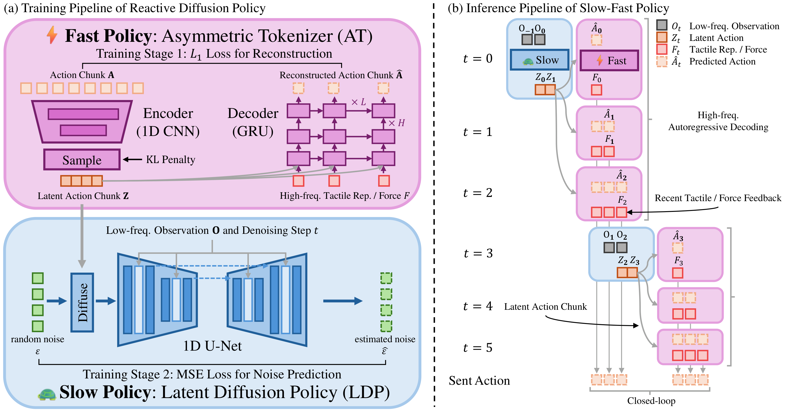

# IL-02：反应式扩散策略

**类型：** 模仿学习 | **触觉支持：** ✓ | **适用任务：** T04, T05, T07

---

## 架构图

**反应扩散策略模型架构**

---

## 原始工作

- 论文：[Reactive Diffusion Policy: Slow-Fast Visual-Tactile Policy Learning for Contact-Rich Dexterous Manipulation](https://arxiv.org/abs/2503.02881)（TODO — 确认 arxiv ID）
- 代码：*TODO — 补充仓库链接*
- 本仓库 Acknowledgements 中提及

---

## 核心思路

**动机：** 标准 Diffusion Policy 推理需多步去噪（~100 ms），无法响应高频触觉反馈；但高频闭环控制又不适合用扩散过程全量建模。

**慢-快双循环架构：**

| 循环 | 频率 | 输入 | 输出 |
|------|------|------|------|
| 慢循环（扩散）| ~10 Hz | RGB + 关节状态 | Action chunk（未来 N 步动作）|
| 快循环（触觉修正）| ~100–500 Hz | 触觉 token + 当前状态 | 对慢循环输出的在线修正量 |

**触觉 token：** 将触觉传感器读数（压力分布时序）编码为紧凑向量，送入轻量快循环网络。

**训练：** 两路分别训练。慢循环用标准扩散目标；快循环用监督回归，触觉修正标签来自示范数据中的接触事件标注。

---

## 在 DexBench 中的适配

| 设置 | 说明 |
|------|------|
| 仿真环境 | MuJoCo（精确接触动力学）|
| 适用任务 | T04（精密插接）、T05（拧紧）、T07（滑动检测）|
| 触觉传感器 | 仿真压力传感器（详见 `tactile/` 模块）|
| 对照实验 | 与 IL-01（无触觉扩散策略）进行触觉增益对比 |

---

## 参考资料

- *TODO — 补充完整引用*
