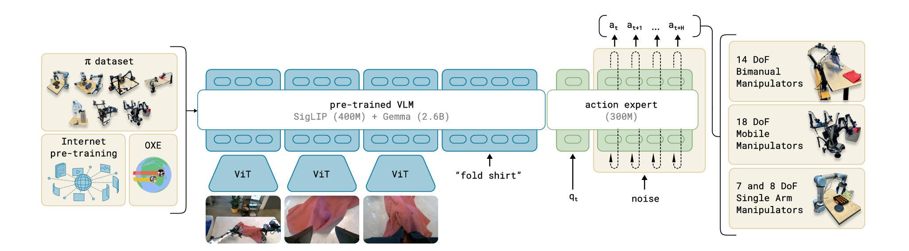

# VLA-06：π0

**类型：** 视觉-语言-动作模型 | **触觉支持：** ✗ | **适用任务：** T01, T10, T11

---

## 原始工作

- 论文：[π0: A Vision-Language-Action Flow Model for General Robot Control](https://arxiv.org/abs/2410.24164)（Black et al. / Physical Intelligence, 2024）
- 代码：[physical-intelligence/openpi](https://github.com/physical-intelligence/openpi)
- 项目主页：[pi.website/blog/pi0](https://www.physicalintelligence.company/blog/pi0)

---

## 核心思路

π0 是 Physical Intelligence 提出的通用机器人 VLA，核心贡献是将**流匹配（Flow Matching）**作为动作生成机制，替代自回归 token 预测，实现连续、高频的动作输出。

**架构：**

| 组件 | 模型 | 说明 |
|------|------|------|
| VLM 主干 | PaliGemma（3B）| 处理图像 + 语言指令，输出语义特征 |
| 动作专家 | 流匹配网络 | 以 VLM 特征为条件，生成连续动作序列 |

**预训练策略：**
- 在大规模多样化机器人操作数据上预训练（包含灵巧手任务）
- 支持多种机器人形态的混合训练
- 下游任务通过少量数据微调（few-shot fine-tuning）

**与 OpenVLA（VLA-01）的区别：**
- OpenVLA 用自回归离散 token 预测动作，π0 用流匹配生成连续动作
- π0 预训练数据规模更大、形态更多样
- π0 推理更快（流匹配 1–2 步 vs. 自回归逐 token 生成）

---

## 在 DexBench 中的适配

| 设置 | 说明 |
|------|------|
| 仿真环境 | Isaac Lab |
| 基座模型 | π0（openpi 开源权重）|
| 微调数据 | DexBench 遥操作示范 / DexMimicGen 合成数据 |
| 适用任务 | T01（抓取，验证灵巧手预训练迁移）、T10（语言条件）、T11（长时程）|
| 对照实验 | 与 VLA-01（OpenVLA-OFT）对比：预训练规模 + 流匹配 vs. LoRA 微调 + 自回归的影响 |

---

## 参考资料

- Black, K., et al. (2024). *π0: A Vision-Language-Action Flow Model for General Robot Control*. arXiv:2410.24164.
