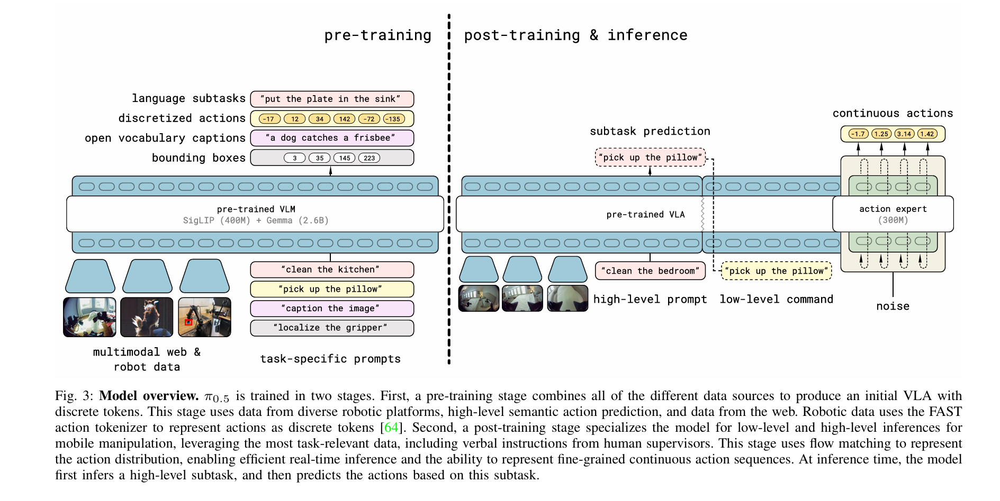

# VLA-07：π0.5

**类型：** 视觉-语言-动作模型 | **触觉支持：** ✗ | **适用任务：** T10, T11

---

## 原始工作

- 论文：[π0.5: a Vision-Language-Action Model with Open-World Generalization](https://arxiv.org/abs/2504.16054)（Black et al. / Physical Intelligence, 2025）
- 代码：[physical-intelligence/openpi](https://github.com/physical-intelligence/openpi)

---

## 核心思路

π0.5 在 π0（VLA-06）基础上解决**开放世界泛化**问题：π0 需要针对每个新任务微调，π0.5 目标是零样本或少样本跟随任意语言指令，无需额外微调。

**相比 π0 的关键改进：**

| 维度 | π0（VLA-06）| π0.5（VLA-07）|
|------|------------|--------------|
| 语言泛化 | 微调后的固定指令集 | 开放词汇，零样本跟随 |
| 任务适配 | 需要下游微调 | 少样本或无需微调 |
| 规划能力 | 单步动作生成 | 支持长时程任务分解 |
| 数据规模 | 大规模预训练 | 更大规模 + 网络数据增强 |

**推理时的双层结构：**
- 高层推理（低频）：当前场景 → 预测语义子任务（如 "pick up the cutting board"）
- 低层推理（高频）：子任务语言 + 图像 → 连续动作 chunk（flow matching）

本质上是把 Chain-of-Thought 移植到机器人控制里。
**与 VLA-05（层级式 VLA）的区别：**
- VLA-05 是以 π0.5 为灵感构建的**自定义层级架构**，高层 VLM 与低层策略分离
- VLA-07 是 π0.5 的**直接实现**，端到端模型，不做额外的层级拆分

---

## 在 DexBench 中的适配

| 设置 | 说明 |
|------|------|
| 仿真环境 | Isaac Lab |
| 基座模型 | π0.5（openpi 开源权重）|
| 微调数据 | 最小量微调或零样本（重点评测开放世界泛化能力）|
| 适用任务 | T10（开放词汇指令，直接测试泛化上限）、T11（长时程，评测任务分解能力）|
| 对照实验 | 与 VLA-06（π0）对比：开放世界泛化带来的提升；与 VLA-05 对比：端到端 vs. 显式层级架构 |

---

## 参考资料

- Black, K., et al. (2025). *π0.5: a Vision-Language-Action Model with Open-World Generalization*. arXiv:2504.16054.
